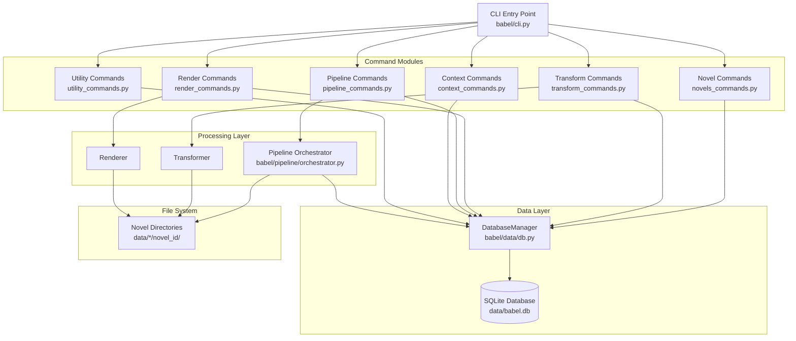

# Design Document: CLI SQLite Migration

## Overview

This design specifies the migration of the BABEL CLI to use SQLite database consistently with the backend API. The migration transforms the CLI from a filesystem-centric tool to a database-first architecture where all novel and chapter operations are managed through the DatabaseManager singleton. This ensures consistency between CLI and backend, enables proper multi-novel support, and provides robust state tracking across all operations.

### Key Design Principles

1. **Database-First Architecture**: All novel and chapter metadata stored in SQLite, filesystem used only for content files
2. **Unified Data Layer**: CLI and backend API share the same DatabaseManager and database file
3. **Novel-Centric Operations**: All commands operate on novels identified by novel_id
4. **Backward Compatibility**: Legacy chapters with NULL novel_id continue to work
5. **Transaction Safety**: All database operations wrapped in transactions with rollback on failure

### Migration Scope

The migration affects all CLI command modules:
- Novel management commands (new)
- Transform commands (modified for novel_id)
- Render commands (modified for novel_id)
- Pipeline commands (modified for novel_id)
- Context commands (modified for novel_id)
- Utility commands (extended with database operations)

## Architecture

### Component Diagram




### Data Flow

#### Ingestion Flow
```
User uploads file → babel ingest <file>
  ↓
Extract metadata (title, author from EPUB or filename)
  ↓
Create novel entry in database → Returns novel_id
  ↓
Create directory structure: data/*/novel_{id}/
  ↓
Extract and store chapters with novel_id foreign key
  ↓
Display novel_id and chapter count to user
```

#### Transform Flow
```
User specifies novel → babel transform batch --novel-id <id>
  ↓
Query database for chapters WHERE novel_id = <id>
  ↓
Read clean files from data/clean/novel_{id}/
  ↓
Transform to JSON
  ↓
Write JSON to data/json/novel_{id}/
  ↓
Update pipeline_state table with novel_id and phase status
```

#### Render Flow
```
User specifies novel → babel render batch --novel-id <id>
  ↓
Query database for chapters WHERE novel_id = <id>
  ↓
Read JSON files from data/json/novel_{id}/
  ↓
Render to HTML
  ↓
Write HTML to data/render/novel_{id}/
  ↓
Generate chapter_map_novel_{id}.json
  ↓
Update pipeline_state table with novel_id and phase status
```

## Components and Interfaces

### 1. Novel Commands Module (NEW)

**File**: `babel/cli_commands/novels_commands.py`

**Purpose**: Provide CLI commands for novel management operations.

**Commands**:

```python
@app.command("list")
def list_novels(
    limit: int = typer.Option(100, "--limit", "-l"),
    offset: int = typer.Option(0, "--offset"),
    status: Optional[str] = typer.Option(None, "--status", "-s")
) -> None:
    """List all novels in the database."""
    
@app.command("get")
def get_novel(
    novel_id: int = typer.Argument(...)
) -> None:
    """Get details for a specific novel."""
    
@app.command("update")
def update_novel(
    novel_id: int = typer.Argument(...),
    title: Optional[str] = typer.Option(None, "--title"),
    author: Optional[str] = typer.Option(None, "--author"),
    cover_url: Optional[str] = typer.Option(None, "--cover-url"),
    status: Optional[str] = typer.Option(None, "--status")
) -> None:
    """Update novel metadata."""
    
@app.command("delete")
def delete_novel(
    novel_id: int = typer.Argument(...),
    force: bool = typer.Option(False, "--force", "-f")
) -> None:
    """Delete a novel and all associated data."""
```

**Implementation Details**:
- Uses Rich library for formatted table output
- Queries DatabaseManager for all operations
- Displays chapter_count using efficient SQL aggregation
- Prompts for confirmation on destructive operations
- Cleans up filesystem directories on deletion


### 2. Ingestion Command (NEW)

**File**: `babel/cli_commands/ingest_commands.py`

**Purpose**: Provide CLI command for ingesting novel files into the database.

**Command**:

```python
@app.command("ingest")
def ingest_novel(
    input_file: Path = typer.Argument(...),
    title: Optional[str] = typer.Option(None, "--title", "-t"),
    author: Optional[str] = typer.Option(None, "--author", "-a"),
    extract_metadata: bool = typer.Option(True, "--extract-metadata/--no-extract-metadata")
) -> None:
    """Ingest a novel file and create database entry."""
```

**Implementation Details**:
- Supports EPUB and text file formats
- Extracts metadata from EPUB Dublin Core (dc:title, dc:creator)
- Falls back to filename parsing if EPUB extraction fails
- Creates novel entry in database first
- Wraps novel creation and directory setup in transaction
- Rolls back database entry if directory creation fails
- Extracts chapters and associates with novel_id
- Displays novel_id and chapter count on success

**Metadata Extraction Logic**:

```python
def extract_novel_metadata(file_path: Path) -> Dict[str, str]:
    """
    Extract novel metadata from file.
    
    Priority:
    1. EPUB Dublin Core metadata (if EPUB file)
    2. Filename parsing
    3. Default to filename as title
    """
    if file_path.suffix.lower() == '.epub':
        metadata = extract_epub_metadata(file_path)
        if metadata:
            return metadata
    
    # Fallback to filename parsing
    title = parse_title_from_filename(file_path.name)
    return {"title": title, "author": None}

def parse_title_from_filename(filename: str) -> str:
    """
    Parse title from filename.
    
    Rules:
    - Remove file extension
    - Extract text before " - Book " if present
    - Replace underscores with spaces
    - Preserve hyphens surrounded by spaces
    - Trim whitespace
    """
    name = Path(filename).stem
    
    # Extract before " - Book "
    if " - Book " in name:
        name = name.split(" - Book ")[0]
    
    # Replace underscores with spaces
    name = name.replace("_", " ")
    
    # Trim and return
    return name.strip() or filename
```

### 3. Chapter Commands Module (NEW)

**File**: `babel/cli_commands/chapters_commands.py`

**Purpose**: Provide CLI commands for chapter listing and management.

**Commands**:

```python
@app.command("list")
def list_chapters(
    novel_id: Optional[int] = typer.Option(None, "--novel-id", "-n"),
    limit: int = typer.Option(100, "--limit", "-l"),
    offset: int = typer.Option(0, "--offset")
) -> None:
    """List chapters, optionally filtered by novel."""
```

**Implementation Details**:
- Queries DatabaseManager.get_chapters_by_novel() when novel_id provided
- Queries DatabaseManager.get_all_chapters() when novel_id not provided
- Displays chapter_id, chapter_index, filename, title in table
- Shows novel_id column when listing all chapters
- Indicates legacy chapters with NULL novel_id


### 4. Modified Transform Commands

**File**: `babel/cli_commands/transform_commands.py`

**Changes**:
- Add `--novel-id` option to `transform batch` command
- Query database for chapters when novel_id provided
- Use novel-specific directory paths
- Update pipeline_state with novel_id

**Modified Command Signature**:

```python
@app.command("batch")
def transform_batch(
    input_dir: Optional[Path] = typer.Option(None, "--input", "-i"),
    output_dir: Optional[Path] = typer.Option(None, "--output", "-o"),
    provider: str = typer.Option("groq", "--provider", "-p"),
    pattern: str = typer.Option("*.txt", "--pattern"),
    novel_id: Optional[int] = typer.Option(None, "--novel-id", "-n")
) -> None:
    """Transform multiple chapters in batch."""
```

**Implementation Logic**:

```python
def transform_batch(...):
    db = DatabaseManager()
    
    if novel_id is not None:
        # Novel-specific processing
        novel = db.get_novel(novel_id)
        if not novel:
            console.print(f"[red]Novel with ID {novel_id} not found[/red]")
            raise typer.Exit(1)
        
        # Use novel-specific directories
        if input_dir is None:
            input_dir = Path(f"data/clean/novel_{novel_id}")
        if output_dir is None:
            output_dir = Path(f"data/json/novel_{novel_id}")
        
        # Get chapters from database
        chapters = db.get_chapters_by_novel(novel_id)
        
        # Update pipeline state
        db.update_pipeline_state(
            phase="transform",
            status="running",
            novel_id=novel_id,
            total_chapters=len(chapters)
        )
    else:
        # Legacy processing (backward compatibility)
        if input_dir is None:
            input_dir = Path("data/clean")
        if output_dir is None:
            output_dir = Path("data/json")
    
    # Process chapters...
    
    # Update final state
    if novel_id is not None:
        db.update_pipeline_state(
            phase="transform",
            status="complete",
            novel_id=novel_id,
            last_chapter=len(chapters),
            total_chapters=len(chapters)
        )
```

### 5. Modified Render Commands

**File**: `babel/cli_commands/render_commands.py`

**Changes**:
- Add `--novel-id` option to `render batch` command
- Query database for chapters when novel_id provided
- Use novel-specific directory paths
- Generate novel-specific chapter map
- Update pipeline_state with novel_id

**Modified Command Signature**:

```python
@app.command("batch")
def render_batch(
    input_dir: Optional[Path] = typer.Option(None, "--input", "-i"),
    output_dir: Optional[Path] = typer.Option(None, "--output", "-o"),
    template: Optional[Path] = typer.Option(None, "--template", "-t"),
    theme: str = typer.Option("default", "--theme"),
    novel_id: Optional[int] = typer.Option(None, "--novel-id", "-n")
) -> None:
    """Render multiple chapters to individual HTML files."""
```

**Chapter Map Generation**:

```python
def generate_chapter_map(novel_id: Optional[int], chapters: List[Dict]) -> Path:
    """
    Generate chapter map file.
    
    Returns:
    - config/chapter_map_novel_{id}.json if novel_id provided
    - config/chapter_map.json for legacy
    """
    if novel_id is not None:
        map_path = Path(f"config/chapter_map_novel_{novel_id}.json")
        metadata = {"novel_id": novel_id}
    else:
        map_path = Path("config/chapter_map.json")
        metadata = {}
    
    chapter_map = {
        "metadata": metadata,
        "chapters": [
            {
                "index": ch["chapter_index"],
                "title": ch["title"],
                "filename": ch["filename"]
            }
            for ch in chapters
        ]
    }
    
    map_path.write_text(json.dumps(chapter_map, indent=2))
    return map_path
```


### 6. Modified Pipeline Commands

**File**: `babel/cli_commands/pipeline_commands.py`

**Changes**:
- Make `--novel-id` required for `pipeline run` command
- Add `--novel-id` option to `pipeline status` command
- Query database for novel and chapters
- Pass novel_id to PipelineOrchestrator
- Display novel-specific progress

**Modified Command Signatures**:

```python
@app.command("run")
def run_pipeline(
    novel_id: int = typer.Option(..., "--novel-id", "-n"),
    config: Path = typer.Option("config/pipeline.yaml", "--config", "-c"),
    provider: str = typer.Option("gemini", "--provider", "-p"),
    skip_transform: bool = typer.Option(False, "--skip-transform"),
    skip_render: bool = typer.Option(False, "--skip-render")
) -> None:
    """Run the complete processing pipeline for a novel."""

@app.command("status")
def pipeline_status(
    novel_id: int = typer.Option(..., "--novel-id", "-n")
) -> None:
    """Show pipeline status for a novel."""

@app.command("run-all")
def run_all_pipelines(
    status: str = typer.Option("active", "--status", "-s"),
    provider: str = typer.Option("gemini", "--provider", "-p"),
    skip_transform: bool = typer.Option(False, "--skip-transform"),
    skip_render: bool = typer.Option(False, "--skip-render")
) -> None:
    """Run pipeline for all novels with specified status."""
```

**Implementation Logic**:

```python
def run_pipeline(novel_id: int, ...):
    db = DatabaseManager()
    
    # Verify novel exists
    novel = db.get_novel(novel_id)
    if not novel:
        console.print(f"[red]Novel with ID {novel_id} not found[/red]")
        raise typer.Exit(1)
    
    # Get chapters
    chapters = db.get_chapters_by_novel(novel_id)
    if not chapters:
        console.print(f"[yellow]Novel '{novel['title']}' has no chapters[/yellow]")
        raise typer.Exit(0)
    
    # Create orchestrator with novel_id
    orchestrator = PipelineOrchestrator(
        config=pipeline_config,
        input_path=Path(f"data/raw/novel_{novel_id}"),
        novel_id=novel_id
    )
    
    # Initialize novel-specific directories
    orchestrator.initialize_directories()
    
    # Run pipeline
    console.print(f"[bold cyan]Processing novel: {novel['title']}[/bold cyan]")
    console.print(f"[cyan]Novel ID: {novel_id}[/cyan]")
    console.print(f"[cyan]Chapters: {len(chapters)}[/cyan]\n")
    
    result = orchestrator.execute()
    
    # Display results
    console.print(f"\n[green]✓[/green] Pipeline completed")
    console.print(f"  Novel: {novel['title']}")
    console.print(f"  Chapters processed: {result.chapters_processed}")
    console.print(f"  Chapters failed: {result.chapters_failed}")
    console.print(f"  Execution time: {result.execution_time:.2f}s")

def pipeline_status(novel_id: int):
    db = DatabaseManager()
    
    # Verify novel exists
    novel = db.get_novel(novel_id)
    if not novel:
        console.print(f"[red]Novel with ID {novel_id} not found[/red]")
        raise typer.Exit(1)
    
    # Get pipeline states
    states = db.get_all_pipeline_states(novel_id)
    
    # Display in table
    table = Table(title=f"Pipeline Status: {novel['title']}")
    table.add_column("Phase", style="cyan")
    table.add_column("Status", style="magenta")
    table.add_column("Progress", style="white")
    table.add_column("Error", style="red")
    
    for state in states:
        progress = f"{state['last_chapter'] or 0}/{state['total_chapters'] or 0}"
        error = state['error_message'] or ""
        table.add_row(
            state['phase'],
            state['status'],
            progress,
            error[:50] + "..." if len(error) > 50 else error
        )
    
    console.print(table)
```


### 7. Modified Context Commands

**File**: `babel/cli_commands/context_commands.py`

**Changes**:
- Add `--novel-id` option to `context build` command
- Use novel-specific directory paths
- Store context in novel-specific location

**Modified Command Signature**:

```python
@app.command("build")
def build_context(
    input_dir: Optional[Path] = typer.Option(None, "--input", "-i"),
    output_file: Optional[Path] = typer.Option(None, "--output", "-o"),
    glossary: Path = typer.Option("config/glossary.yaml", "--glossary", "-g"),
    novel_id: Optional[int] = typer.Option(None, "--novel-id", "-n")
) -> None:
    """Build context from chapter JSON files."""
```

**Implementation Logic**:

```python
def build_context(novel_id: Optional[int], ...):
    if novel_id is not None:
        db = DatabaseManager()
        novel = db.get_novel(novel_id)
        if not novel:
            console.print(f"[red]Novel with ID {novel_id} not found[/red]")
            raise typer.Exit(1)
        
        # Use novel-specific paths
        if input_dir is None:
            input_dir = Path(f"data/json/novel_{novel_id}")
        if output_file is None:
            output_file = Path(f"data/context/novel_{novel_id}/context.json")
        
        output_file.parent.mkdir(parents=True, exist_ok=True)
    else:
        # Legacy paths
        if input_dir is None:
            input_dir = Path("data/json")
        if output_file is None:
            output_file = Path("data/context/context.json")
    
    # Build context...
```

### 8. Extended Utility Commands

**File**: `babel/cli_commands/utility_commands.py`

**New Commands**:

```python
@app.command("db-info")
def database_info() -> None:
    """Display database statistics."""

@app.command("db-check")
def database_check() -> None:
    """Verify database integrity."""

@app.command("db-vacuum")
def database_vacuum() -> None:
    """Optimize database file."""
```

**Implementation Details**:

```python
def database_info():
    db = DatabaseManager()
    
    # Gather statistics
    novel_count = db.count_novels()
    chapters = db.get_all_chapters()
    chapter_count = len(chapters)
    chapters_with_novel = sum(1 for ch in chapters if ch['novel_id'] is not None)
    legacy_chapters = chapter_count - chapters_with_novel
    db_size = db.db_path.stat().st_size / (1024 * 1024)  # MB
    
    # Display
    table = Table(title="Database Information")
    table.add_column("Metric", style="cyan")
    table.add_column("Value", style="white")
    
    table.add_row("Database Path", str(db.db_path))
    table.add_row("Database Size", f"{db_size:.2f} MB")
    table.add_row("Total Novels", str(novel_count))
    table.add_row("Total Chapters", str(chapter_count))
    table.add_row("Chapters with Novel", str(chapters_with_novel))
    table.add_row("Legacy Chapters", str(legacy_chapters))
    
    console.print(table)

def database_check():
    db = DatabaseManager()
    issues = []
    
    # Check for orphaned chapters (novel_id references non-existent novel)
    chapters = db.get_all_chapters()
    novels = {n['id'] for n in db.list_novels(limit=10000)}
    
    for chapter in chapters:
        if chapter['novel_id'] is not None and chapter['novel_id'] not in novels:
            issues.append(f"Chapter {chapter['id']} references non-existent novel {chapter['novel_id']}")
    
    # Check for missing files
    for chapter in chapters:
        if chapter['novel_id'] is not None:
            clean_path = Path(f"data/clean/novel_{chapter['novel_id']}/{chapter['filename']}")
            if not clean_path.exists():
                issues.append(f"Missing clean file for chapter {chapter['id']}: {clean_path}")
    
    # Check for inconsistent pipeline state
    states = []
    for novel in db.list_novels(limit=10000):
        novel_states = db.get_all_pipeline_states(novel['id'])
        states.extend(novel_states)
    
    for state in states:
        if state['status'] == 'running':
            issues.append(f"Pipeline state for novel {state['novel_id']} phase {state['phase']} stuck in 'running'")
    
    # Display results
    if issues:
        console.print(f"[red]Found {len(issues)} integrity issues:[/red]\n")
        for issue in issues:
            console.print(f"  [red]•[/red] {issue}")
        raise typer.Exit(1)
    else:
        console.print("[green]✓[/green] Database integrity check passed")

def database_vacuum():
    db = DatabaseManager()
    
    with console.status("[bold green]Optimizing database..."):
        db.connection.execute("VACUUM")
    
    console.print("[green]✓[/green] Database optimized")
```


### 9. Modified Pipeline Orchestrator

**File**: `babel/pipeline/orchestrator.py`

**Changes**:
- Already supports novel_id parameter (existing implementation)
- Ensure all directory operations use `_get_phase_directory()` method
- Ensure chapter map generation uses `_get_chapter_map_path()` method
- Update pipeline_state calls to include novel_id

**Key Methods** (already implemented):

```python
def _get_phase_directory(self, phase: str) -> Path:
    """
    Get directory for a phase.
    Returns data/{phase}/novel_{id}/ or data/{phase}/ for legacy.
    """
    base_dir = self.config.output_dir / phase
    if self.novel_id is not None:
        return base_dir / f"novel_{self.novel_id}"
    else:
        return base_dir

def _get_chapter_map_path(self) -> Path:
    """
    Get chapter map path.
    Returns config/chapter_map_novel_{id}.json or config/chapter_map.json.
    """
    config_dir = Path("config")
    if self.novel_id is not None:
        return config_dir / f"chapter_map_novel_{self.novel_id}.json"
    else:
        return config_dir / "chapter_map.json"

def initialize_directories(self) -> None:
    """Create novel-specific directories for all phases."""
    phases = ['clean', 'json', 'render']
    for phase in phases:
        phase_dir = self._get_phase_directory(phase)
        phase_dir.mkdir(parents=True, exist_ok=True)
```

**Integration with DatabaseManager**:

The orchestrator should update pipeline_state through DatabaseManager:

```python
def _execute_phase_1(self) -> tuple:
    """Execute Phase 1: Transformation."""
    db = DatabaseManager()
    
    # Update state to running
    db.update_pipeline_state(
        phase="transform",
        status="running",
        novel_id=self.novel_id,
        total_chapters=len(chapters)
    )
    
    # Process chapters...
    
    # Update state to complete
    db.update_pipeline_state(
        phase="transform",
        status="complete",
        novel_id=self.novel_id,
        last_chapter=processed,
        total_chapters=len(chapters)
    )
    
    return processed, failed
```

### 10. CLI Entry Point Modifications

**File**: `babel/cli.py`

**Changes**:
- Register new novels_commands module
- Register new ingest_commands module
- Register new chapters_commands module
- Add global `--db-path` option
- Initialize DatabaseManager with custom path if provided

**Modified Code**:

```python
import typer
from pathlib import Path
from typing import Optional
from rich.console import Console

app = typer.Typer(
    name="babel",
    help="BABEL - Webnovel Processing Pipeline",
    add_completion=False,
)

console = Console()

# Global database path option
db_path_option = typer.Option(
    None,
    "--db-path",
    envvar="BABEL_DB_PATH",
    help="Path to SQLite database (default: data/babel.db)"
)

# Import subcommands
from babel.cli_commands import (
    novels_commands,      # NEW
    ingest_commands,      # NEW
    chapters_commands,    # NEW
    transform_commands,
    render_commands,
    context_commands,
    pipeline_commands,
    utility_commands,
)

# Register subcommands
app.add_typer(novels_commands.app, name="novels", help="Manage novels")
app.add_typer(ingest_commands.app, name="ingest", help="Ingest novel files")
app.add_typer(chapters_commands.app, name="chapters", help="Manage chapters")
app.add_typer(transform_commands.app, name="transform", help="Transform text using LLM")
app.add_typer(render_commands.app, name="render", help="Render JSON to HTML")
app.add_typer(context_commands.app, name="context", help="Manage context and glossary")
app.add_typer(pipeline_commands.app, name="pipeline", help="Run full processing pipeline")
app.add_typer(utility_commands.app, name="util", help="Utility and diagnostic commands")

@app.callback()
def main(
    db_path: Optional[Path] = db_path_option,
    verbose: bool = typer.Option(False, "--verbose", "-v")
):
    """
    BABEL - Webnovel Processing Pipeline
    
    Transform raw webnovel files into structured, clean output.
    """
    # Initialize database with custom path if provided
    if db_path:
        from babel.data.db import DatabaseManager
        db = DatabaseManager(db_path)
        if verbose:
            console.print(f"[dim]Using database: {db_path}[/dim]")
```

## Data Models

### Database Schema

The database schema is already defined in `babel/data/db.py`. No changes needed to the schema itself, but CLI must use it consistently.

**Novels Table**:
```sql
CREATE TABLE novels (
    id INTEGER PRIMARY KEY AUTOINCREMENT,
    title TEXT NOT NULL,
    author TEXT,
    cover_url TEXT,
    synopsis TEXT,
    tags TEXT,
    status TEXT DEFAULT 'active',
    created_at TIMESTAMP DEFAULT CURRENT_TIMESTAMP,
    updated_at TIMESTAMP DEFAULT CURRENT_TIMESTAMP
)
```

**Chapters Table**:
```sql
CREATE TABLE chapters (
    id INTEGER PRIMARY KEY AUTOINCREMENT,
    novel_id INTEGER,
    chapter_index INTEGER NOT NULL,
    filename TEXT NOT NULL,
    title TEXT,
    created_at TIMESTAMP DEFAULT CURRENT_TIMESTAMP,
    FOREIGN KEY (novel_id) REFERENCES novels(id) ON DELETE CASCADE
)
```

**Pipeline State Table**:
```sql
CREATE TABLE pipeline_state (
    id INTEGER PRIMARY KEY AUTOINCREMENT,
    novel_id INTEGER,
    phase TEXT NOT NULL,
    status TEXT NOT NULL,
    last_chapter INTEGER,
    total_chapters INTEGER,
    error_message TEXT,
    updated_at TIMESTAMP DEFAULT CURRENT_TIMESTAMP,
    FOREIGN KEY (novel_id) REFERENCES novels(id) ON DELETE CASCADE,
    UNIQUE(novel_id, phase)
)
```

### File System Structure

```
data/
├── babel.db                          # SQLite database
├── raw/
│   └── novel_{id}/                   # Raw uploaded files
│       └── novel.epub
├── clean/
│   ├── novel_{id}/                   # Novel-specific clean files
│   │   ├── chapter_001.txt
│   │   └── chapter_002.txt
│   └── chapter_legacy.txt            # Legacy files (NULL novel_id)
├── json/
│   ├── novel_{id}/                   # Novel-specific JSON files
│   │   ├── chapter_001.json
│   │   └── chapter_002.json
│   └── chapter_legacy.json           # Legacy files
├── render/
│   ├── novel_{id}/                   # Novel-specific HTML files
│   │   ├── chapter_001.html
│   │   └── chapter_002.html
│   └── chapter_legacy.html           # Legacy files
└── context/
    ├── novel_{id}/                   # Novel-specific context
    │   └── context.json
    └── context.json                  # Legacy context

config/
├── chapter_map_novel_{id}.json       # Novel-specific chapter maps
└── chapter_map.json                  # Legacy chapter map
```


## Correctness Properties

A property is a characteristic or behavior that should hold true across all valid executions of a system—essentially, a formal statement about what the system should do. Properties serve as the bridge between human-readable specifications and machine-verifiable correctness guarantees.

### Property 1: Novel ID Validation Across All Commands

*For any* CLI command that accepts a novel_id parameter, when a non-existent novel_id is provided, the command should display an error message containing the novel_id and exit with status code 1.

**Validates: Requirements 1.6, 3.5, 4.6, 6.6, 9.7, 17.6**

### Property 2: Novel List Ordering

*For any* set of novels in the database with different updated_at timestamps, executing `babel novels list` should return novels ordered by updated_at in descending order (most recent first).

**Validates: Requirements 1.2**

### Property 3: Chapter List Ordering

*For any* set of chapters belonging to a novel, executing `babel chapters list --novel-id <id>` should return chapters ordered by chapter_index in ascending order.

**Validates: Requirements 6.2**

### Property 4: Novel-Specific Directory Path Construction

*For any* novel_id and phase (clean, json, render), the CLI should construct directory paths as `data/{phase}/novel_{novel_id}/` when processing that novel.

**Validates: Requirements 3.3, 4.2, 4.3, 8.1, 8.2, 8.3, 8.4, 12.2, 12.3**

### Property 5: Chapter Database Filtering

*For any* novel_id, when querying chapters for that novel, the CLI should return only chapters where the chapter's novel_id foreign key matches the requested novel_id.

**Validates: Requirements 3.2, 5.2**

### Property 6: Pipeline State Tracking

*For any* novel_id and phase (sanitize, transform, render), when that phase completes processing, the CLI should update the pipeline_state table with the novel_id, phase name, status, and chapter counts.

**Validates: Requirements 3.6, 4.5, 5.3**

### Property 7: Metadata Extraction from EPUB

*For any* valid EPUB file containing Dublin Core metadata (dc:title and dc:creator) in content.opf, executing `babel ingest` should extract and store the title and author in the novel database entry.

**Validates: Requirements 2.6**

### Property 8: Metadata Extraction Fallback

*For any* file where EPUB metadata extraction fails or the file is not an EPUB, executing `babel ingest` should fall back to extracting the title from the filename using the parsing rules (remove extension, extract before " - Book ", replace underscores with spaces).

**Validates: Requirements 2.2, 2.7**

### Property 9: Chapter-Novel Association

*For any* novel created through ingestion, all extracted chapters should be stored in the database with the novel_id foreign key referencing the created novel.

**Validates: Requirements 2.4**

### Property 10: Transaction Atomicity for Novel Creation

*For any* novel ingestion operation, if directory creation fails after the database entry is created, the database transaction should be rolled back, leaving no novel entry in the database.

**Validates: Requirements 2.5, 20.1, 20.2**

### Property 11: Cascade Deletion

*For any* novel_id, when executing `babel novels delete <novel_id>` with confirmation, the database should delete the novel entry and automatically cascade delete all associated chapters and pipeline_state records due to foreign key constraints.

**Validates: Requirements 9.3**

### Property 12: Filesystem Cleanup on Deletion

*For any* novel_id, when executing `babel novels delete <novel_id>` with confirmation, the CLI should attempt to delete all directories matching `data/*/novel_{novel_id}/` from the filesystem.

**Validates: Requirements 9.4**

### Property 13: Graceful Filesystem Cleanup Failure

*For any* novel deletion where filesystem cleanup fails, the database deletion should still complete successfully, and the CLI should display a warning about the filesystem failure.

**Validates: Requirements 9.5**

### Property 14: Legacy Chapter Inclusion

*For any* query for all chapters (without novel_id filter), the results should include both chapters with a novel_id foreign key and chapters with NULL novel_id (legacy chapters).

**Validates: Requirements 10.3**

### Property 15: Database Schema Initialization

*For any* new database file, when the DatabaseManager is first initialized, it should create all required tables (novels, chapters, pipeline_state) with correct schema including foreign key constraints.

**Validates: Requirements 11.2**

### Property 16: Foreign Key Enforcement

*For any* database connection, the DatabaseManager should execute `PRAGMA foreign_keys = ON` to enable foreign key constraint enforcement.

**Validates: Requirements 11.5**

### Property 17: Database Path Configuration Precedence

*For any* execution of the CLI, when both `--db-path` option and `BABEL_DB_PATH` environment variable are set, the `--db-path` option value should be used for the database location.

**Validates: Requirements 16.3**

### Property 18: Automatic Directory Creation

*For any* database path where the parent directory does not exist, the CLI should automatically create the directory before initializing the database.

**Validates: Requirements 16.5**

### Property 19: Novel Update Field Application

*For any* novel_id and set of update fields (title, author, cover_url, status), executing `babel novels update <novel_id>` with those fields should modify only the specified fields in the database, leaving other fields unchanged.

**Validates: Requirements 17.3**

### Property 20: Status Filtering

*For any* status value, executing `babel novels list --status <status>` should return only novels where the status field matches the provided value.

**Validates: Requirements 18.2**

### Property 21: Batch Processing Resilience

*For any* set of novels being processed by `babel pipeline run-all`, if one novel's pipeline fails, the CLI should continue processing remaining novels and report all failures at the end.

**Validates: Requirements 18.5**

### Property 22: Chapter Map Novel ID Inclusion

*For any* novel_id, when generating a chapter map file for that novel, the resulting JSON should contain a metadata section with the novel_id field set to the correct value.

**Validates: Requirements 19.2**

### Property 23: Chapter Map Novel ID Verification

*For any* chapter map file being loaded for a specific novel_id, if the chapter map's metadata.novel_id does not match the requested novel_id, the CLI should reject the chapter map and display an error.

**Validates: Requirements 19.3**

### Property 24: Transaction Rollback on Failure

*For any* database operation wrapped in a transaction, if any part of the operation fails, the entire transaction should be rolled back, leaving the database in its pre-operation state.

**Validates: Requirements 14.5, 20.5**

### Property 25: Pipeline State Filtering

*For any* novel_id, executing `babel pipeline status --novel-id <id>` should query and display only pipeline_state records where the novel_id field matches the provided value.

**Validates: Requirements 5.7, 7.2**

### Property 26: Ingestion Success Output

*For any* successful novel ingestion, the CLI should display output containing both the created novel_id and the count of extracted chapters.

**Validates: Requirements 2.3, 2.8**

### Property 27: Novel Metadata Display Completeness

*For any* novel retrieved by `babel novels get <novel_id>`, the displayed output should include all metadata fields: id, title, author, cover_url, synopsis, tags, status, created_at, updated_at, and chapter_count.

**Validates: Requirements 1.5, 1.7**

### Property 28: Database Error Message Clarity

*For any* database operation that fails with a database error, the CLI should display an error message that includes the specific database error details.

**Validates: Requirements 14.1**

### Property 29: Novel Not Found Error Format

*For any* non-existent novel_id used in a command, the error message should follow the format "Novel with ID {id} not found" where {id} is the provided novel_id.

**Validates: Requirements 14.2**

### Property 30: Database Integrity Check Detection

*For any* database state containing orphaned chapters (chapters with novel_id referencing non-existent novels), missing files (chapters without corresponding filesystem files), or stuck pipeline states (status='running' for completed operations), executing `babel util db-check` should detect and report all such issues.

**Validates: Requirements 13.4, 13.5**


## Error Handling

### Error Categories

#### 1. Database Errors

**Connection Failures**:
- Display: "Failed to connect to database at {path}"
- Exit code: 1
- Action: Check database path and permissions

**Query Failures**:
- Display: "Database query failed: {error_message}"
- Exit code: 1
- Action: Include full database error for debugging

**Constraint Violations**:
- Display: "Foreign key constraint violated: {explanation}"
- Exit code: 1
- Action: Explain the relationship constraint that was violated

**Transaction Failures**:
- Display: "Transaction failed: {error_message}"
- Action: Automatic rollback, display error, exit code 1

#### 2. Validation Errors

**Missing Novel ID**:
- Display: "Novel with ID {id} not found"
- Exit code: 1
- Action: Verify novel exists in database

**Missing Required Parameters**:
- Display: "Error: --novel-id is required for this command"
- Exit code: 1
- Action: Show command help

**Invalid File Format**:
- Display: "Error: Unsupported file format. Expected EPUB or text file."
- Exit code: 1
- Action: Check file extension and format

#### 3. Filesystem Errors

**Directory Creation Failure**:
- Display: "Failed to create directory {path}: {error}"
- Action: Rollback database transaction if part of atomic operation
- Exit code: 1

**File Not Found**:
- Display: "File not found: {path}"
- Exit code: 1
- Action: Verify file path

**Permission Denied**:
- Display: "Permission denied: {path}"
- Exit code: 1
- Action: Check file/directory permissions

**Cleanup Failure** (non-fatal):
- Display: "Warning: Failed to delete directory {path}: {error}"
- Action: Continue with database deletion, display warning
- Exit code: 0 (operation succeeded despite cleanup failure)

#### 4. Processing Errors

**Metadata Extraction Failure**:
- Action: Fall back to filename parsing
- Log: "EPUB metadata extraction failed, using filename"
- Continue processing

**Chapter Processing Failure**:
- Display: "Failed to process chapter {index}: {error}"
- Action: Record error in pipeline_state, continue with remaining chapters
- Exit code: 0 (partial success)

**Pipeline Phase Failure**:
- Display: "Pipeline phase {phase} failed: {error}"
- Action: Update pipeline_state with error, stop pipeline
- Exit code: 1

### Error Handling Patterns

#### Transaction Wrapper Pattern

```python
def atomic_operation(novel_data: Dict) -> int:
    """
    Perform atomic operation with automatic rollback.
    
    Returns:
        novel_id on success
        
    Raises:
        Exception on failure (after rollback)
    """
    db = DatabaseManager()
    novel_id = None
    
    try:
        with db.transaction() as conn:
            # Create database entry
            novel_id = db.create_novel(**novel_data)
            
            # Create filesystem directories
            for phase in ['clean', 'json', 'render']:
                phase_dir = Path(f"data/{phase}/novel_{novel_id}")
                phase_dir.mkdir(parents=True, exist_ok=True)
            
            # Transaction commits automatically on success
            return novel_id
            
    except Exception as e:
        # Transaction rolls back automatically
        console.print(f"[red]Operation failed: {e}[/red]")
        raise typer.Exit(1)
```

#### Graceful Degradation Pattern

```python
def delete_novel_with_cleanup(novel_id: int) -> None:
    """
    Delete novel with graceful filesystem cleanup.
    
    Database deletion always succeeds.
    Filesystem cleanup failures are logged but don't fail the operation.
    """
    db = DatabaseManager()
    
    # Database deletion (critical)
    try:
        db.delete_novel(novel_id)
        console.print(f"[green]✓[/green] Novel {novel_id} deleted from database")
    except Exception as e:
        console.print(f"[red]Failed to delete novel: {e}[/red]")
        raise typer.Exit(1)
    
    # Filesystem cleanup (best-effort)
    for phase in ['clean', 'json', 'render', 'context']:
        phase_dir = Path(f"data/{phase}/novel_{novel_id}")
        try:
            if phase_dir.exists():
                shutil.rmtree(phase_dir)
        except Exception as e:
            console.print(f"[yellow]Warning: Failed to delete {phase_dir}: {e}[/yellow]")
```

#### Validation Pattern

```python
def validate_novel_exists(novel_id: int) -> Dict[str, Any]:
    """
    Validate novel exists and return novel data.
    
    Returns:
        Novel data dictionary
        
    Raises:
        typer.Exit(1) if novel not found
    """
    db = DatabaseManager()
    novel = db.get_novel(novel_id)
    
    if not novel:
        console.print(f"[red]Novel with ID {novel_id} not found[/red]")
        raise typer.Exit(1)
    
    return novel
```


## Testing Strategy

### Dual Testing Approach

The CLI migration requires both unit tests and property-based tests to ensure comprehensive coverage:

- **Unit tests**: Verify specific examples, edge cases, command existence, and integration points
- **Property tests**: Verify universal properties across all inputs using randomized testing

### Unit Testing Focus

Unit tests should focus on:

1. **Command Existence**: Verify all new commands are registered and callable
2. **Specific Examples**: Test concrete scenarios with known inputs and outputs
3. **Edge Cases**: Empty novels, NULL novel_id, missing files
4. **Integration Points**: Database connections, filesystem operations, error handling
5. **User Interaction**: Confirmation prompts, progress display

**Example Unit Tests**:

```python
def test_novels_list_command_exists():
    """Verify babel novels list command is registered."""
    result = runner.invoke(app, ["novels", "list"])
    assert result.exit_code in [0, 1]  # Command exists

def test_ingest_creates_novel_entry():
    """Verify ingestion creates database entry."""
    result = runner.invoke(app, ["ingest", "test_novel.epub"])
    assert "Novel ID:" in result.stdout
    assert result.exit_code == 0

def test_empty_novel_chapter_list():
    """Verify empty novel displays appropriate message."""
    novel_id = create_test_novel_with_no_chapters()
    result = runner.invoke(app, ["chapters", "list", "--novel-id", str(novel_id)])
    assert "empty" in result.stdout.lower()

def test_novel_deletion_prompts_confirmation():
    """Verify deletion requires confirmation."""
    novel_id = create_test_novel()
    result = runner.invoke(app, ["novels", "delete", str(novel_id)], input="n\n")
    assert "confirm" in result.stdout.lower()
    assert result.exit_code == 0
    # Verify novel still exists
    assert db.get_novel(novel_id) is not None
```

### Property-Based Testing Focus

Property tests should focus on:

1. **Universal Properties**: Behaviors that hold for all valid inputs
2. **Invariants**: Conditions that remain true across operations
3. **Round-Trip Properties**: Operations that should be reversible
4. **Metamorphic Properties**: Relationships between inputs and outputs

**Property Test Configuration**:
- Library: Hypothesis (Python)
- Minimum iterations: 100 per property test
- Each test must reference its design document property
- Tag format: `# Feature: cli-sqlite-migration, Property {number}: {property_text}`

**Example Property Tests**:

```python
from hypothesis import given, strategies as st
import hypothesis

# Feature: cli-sqlite-migration, Property 2: Novel List Ordering
@given(st.lists(st.integers(min_value=1, max_value=1000000), min_size=2, max_size=20))
@hypothesis.settings(max_examples=100)
def test_novel_list_ordering(timestamps):
    """
    For any set of novels with different updated_at timestamps,
    babel novels list should return novels ordered by updated_at descending.
    """
    db = DatabaseManager()
    
    # Create novels with specific timestamps
    novel_ids = []
    for ts in timestamps:
        novel_id = db.create_novel(title=f"Novel {ts}")
        # Update timestamp
        db.connection.execute(
            "UPDATE novels SET updated_at = ? WHERE id = ?",
            (datetime.fromtimestamp(ts), novel_id)
        )
        novel_ids.append(novel_id)
    
    # Query novels
    novels = db.list_novels(limit=len(timestamps))
    
    # Verify ordering
    novel_timestamps = [n['updated_at'] for n in novels if n['id'] in novel_ids]
    assert novel_timestamps == sorted(novel_timestamps, reverse=True)

# Feature: cli-sqlite-migration, Property 4: Novel-Specific Directory Path Construction
@given(
    st.integers(min_value=1, max_value=10000),
    st.sampled_from(['clean', 'json', 'render'])
)
@hypothesis.settings(max_examples=100)
def test_directory_path_construction(novel_id, phase):
    """
    For any novel_id and phase, the CLI should construct paths as
    data/{phase}/novel_{novel_id}/.
    """
    orchestrator = PipelineOrchestrator(
        config=test_config,
        input_path=Path("test"),
        novel_id=novel_id
    )
    
    phase_dir = orchestrator._get_phase_directory(phase)
    expected_path = Path(f"data/{phase}/novel_{novel_id}")
    
    assert phase_dir == expected_path

# Feature: cli-sqlite-migration, Property 5: Chapter Database Filtering
@given(
    st.integers(min_value=1, max_value=100),
    st.lists(st.integers(min_value=0, max_value=50), min_size=1, max_size=20)
)
@hypothesis.settings(max_examples=100)
def test_chapter_filtering_by_novel(target_novel_id, chapter_indices):
    """
    For any novel_id, querying chapters should return only chapters
    with matching novel_id foreign key.
    """
    db = DatabaseManager()
    
    # Create target novel
    db.create_novel(title=f"Novel {target_novel_id}")
    
    # Create other novels
    other_novel_ids = [db.create_novel(title=f"Other {i}") for i in range(3)]
    
    # Create chapters for target novel
    for idx in chapter_indices:
        db.create_chapter(
            chapter_index=idx,
            filename=f"chapter_{idx}.txt",
            novel_id=target_novel_id
        )
    
    # Create chapters for other novels
    for other_id in other_novel_ids:
        db.create_chapter(
            chapter_index=1,
            filename="other.txt",
            novel_id=other_id
        )
    
    # Query chapters for target novel
    chapters = db.get_chapters_by_novel(target_novel_id)
    
    # Verify all chapters belong to target novel
    assert all(ch['novel_id'] == target_novel_id for ch in chapters)
    assert len(chapters) == len(chapter_indices)

# Feature: cli-sqlite-migration, Property 10: Transaction Atomicity for Novel Creation
@given(st.text(min_size=1, max_size=100))
@hypothesis.settings(max_examples=100)
def test_transaction_rollback_on_directory_failure(title):
    """
    For any novel ingestion, if directory creation fails after database insert,
    the transaction should rollback leaving no novel entry.
    """
    db = DatabaseManager()
    initial_count = db.count_novels()
    
    # Mock directory creation to fail
    with patch('pathlib.Path.mkdir', side_effect=OSError("Permission denied")):
        try:
            # Attempt atomic operation
            novel_id = create_novel_with_directories(title)
        except:
            pass
    
    # Verify no novel was created
    final_count = db.count_novels()
    assert final_count == initial_count

# Feature: cli-sqlite-migration, Property 11: Cascade Deletion
@given(
    st.text(min_size=1, max_size=100),
    st.lists(st.integers(min_value=1, max_value=100), min_size=1, max_size=20)
)
@hypothesis.settings(max_examples=100)
def test_cascade_deletion(title, chapter_indices):
    """
    For any novel with chapters, deleting the novel should cascade delete
    all associated chapters and pipeline_state records.
    """
    db = DatabaseManager()
    
    # Create novel
    novel_id = db.create_novel(title=title)
    
    # Create chapters
    for idx in chapter_indices:
        db.create_chapter(
            chapter_index=idx,
            filename=f"ch_{idx}.txt",
            novel_id=novel_id
        )
    
    # Create pipeline state
    db.update_pipeline_state(
        phase="transform",
        status="complete",
        novel_id=novel_id
    )
    
    # Delete novel
    db.delete_novel(novel_id)
    
    # Verify cascade deletion
    assert db.get_novel(novel_id) is None
    assert len(db.get_chapters_by_novel(novel_id)) == 0
    assert len(db.get_all_pipeline_states(novel_id)) == 0

# Feature: cli-sqlite-migration, Property 20: Status Filtering
@given(
    st.lists(
        st.tuples(st.text(min_size=1, max_size=50), st.sampled_from(['active', 'archived', 'deleted'])),
        min_size=5,
        max_size=20
    ),
    st.sampled_from(['active', 'archived', 'deleted'])
)
@hypothesis.settings(max_examples=100)
def test_status_filtering(novels_data, filter_status):
    """
    For any status value, babel novels list --status should return
    only novels with matching status.
    """
    db = DatabaseManager()
    
    # Create novels with various statuses
    for title, status in novels_data:
        db.create_novel(title=title, status=status)
    
    # Query with status filter
    result = runner.invoke(app, ["novels", "list", "--status", filter_status])
    
    # Verify all returned novels have correct status
    novels = db.list_novels(limit=1000)
    filtered_novels = [n for n in novels if n['status'] == filter_status]
    
    # Check that output contains correct novels
    for novel in filtered_novels:
        assert novel['title'] in result.stdout
```

### Integration Testing

Integration tests should verify:

1. **End-to-End Workflows**: Complete ingestion → transform → render pipeline
2. **Database-Filesystem Consistency**: Files match database records
3. **Multi-Novel Isolation**: Processing one novel doesn't affect others
4. **Backward Compatibility**: Legacy chapters continue to work

### Test Data Management

**Test Database**:
- Use in-memory SQLite database (`:memory:`) for unit tests
- Use temporary file database for integration tests
- Clean up test data after each test

**Test Fixtures**:
```python
@pytest.fixture
def test_db():
    """Provide clean test database."""
    db = DatabaseManager(Path(":memory:"))
    yield db
    db.close()

@pytest.fixture
def test_novel(test_db):
    """Provide test novel with chapters."""
    novel_id = test_db.create_novel(title="Test Novel", author="Test Author")
    for i in range(5):
        test_db.create_chapter(
            chapter_index=i,
            filename=f"chapter_{i:03d}.txt",
            novel_id=novel_id,
            title=f"Chapter {i}"
        )
    return novel_id
```

### Coverage Goals

- **Line Coverage**: Minimum 85% for all CLI command modules
- **Branch Coverage**: Minimum 80% for error handling paths
- **Property Coverage**: All 30 correctness properties must have corresponding property tests
- **Integration Coverage**: All major workflows (ingest, transform, render, pipeline) tested end-to-end

